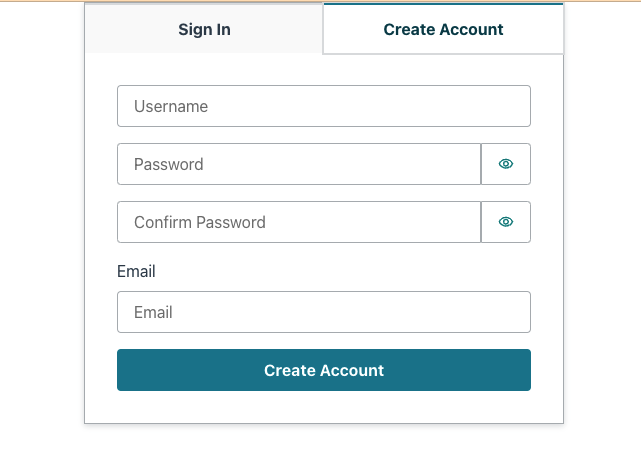
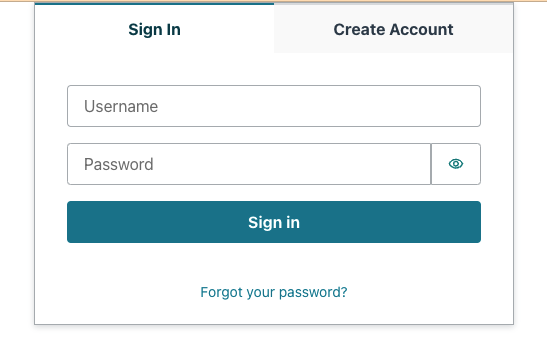
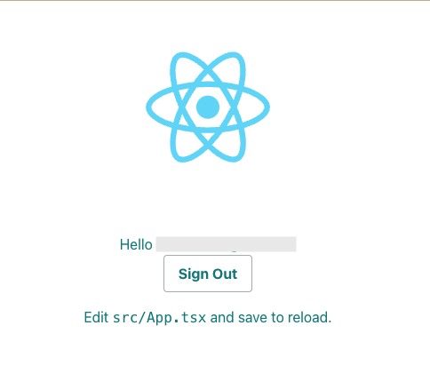

# Create React App with AWS Amplify Auth using Typescript

This repository is a refactor of https://github.com/aws-samples/create-react-app-auth-amplify using Typescript with some additional improvements like Amplify UI.

This app implements new version of Amplify Authenticator from Amplify UI to provide a basic authentication flow for signing up and signing in users as well as protected client side routing using AWS Amplify.

## Prerequisites

You should have an AWS Account ready to use and Node, npm and Amplify CLI installed. For more information, https://docs.amplify.aws/cli/start/install

## Deploy with the AWS Amplify Console

The AWS Amplify Console provides hosting for fullstack serverless web apps. Deploy this app to your AWS account with a single click:

[](https://console.aws.amazon.com/amplify/home#/deploy?repo=https://github.com/aws-samples/create-react-app-amplify-auth-typescript)

The Amplify Console will fork this repo in your GitHub account, and then build and deploy your backend and frontend in a single workflow. Your app will be available at `https://main.appid.amplifyapp.com`.

## Preview





## Run locally with the Amplify CLI

1. Fork the repo in your account and then clone it as below.

```
git clone https://github.com/<username>/create-react-app-amplify-auth-typescript.git
cd create-react-app-amplify-auth-typescript
yarn install
```

2. Pull backend from AWS Amplify using appid and envname which can be found on AWS Amplify UI.

```
amplify pull --appId appid --envName envname
```

3. Run locally

```
yarn start
```
